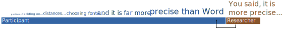
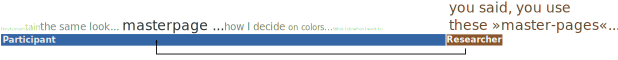
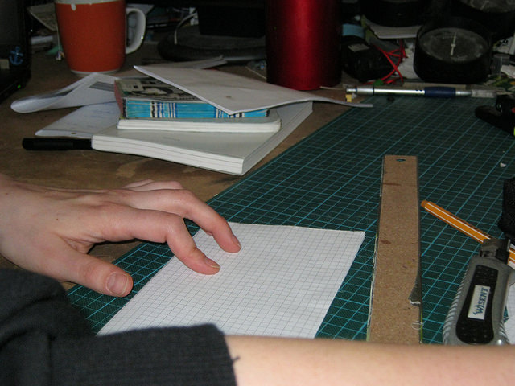
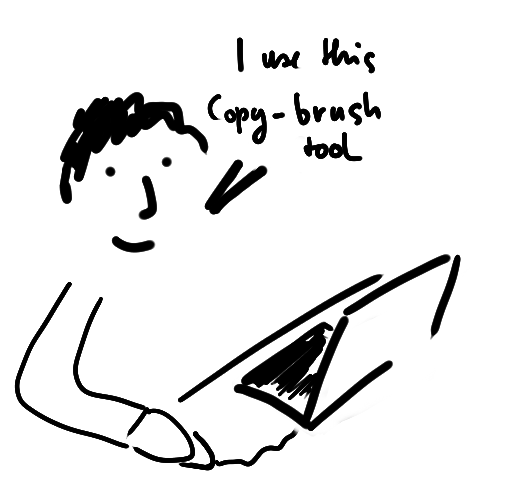
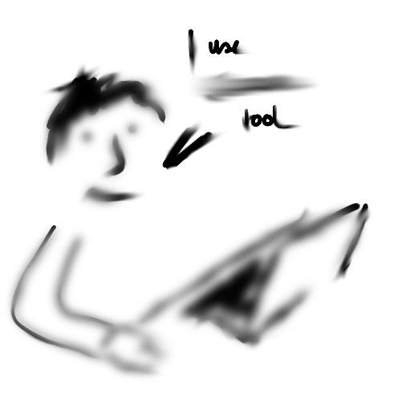
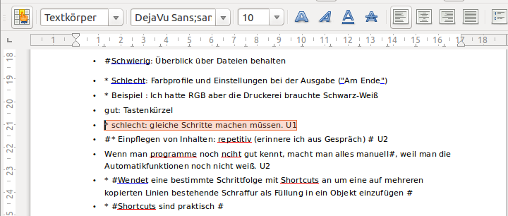

% User needfinding for beginners
% Jan Dittrich
% 2014

<!-- compile with pandoc --toc -B ../templates/includeBefore.pandoc -A ../templates/includeBefore.pandoc  -s -c ../styles/styles.css allURBook.md -o allUR.html-->

# Find People

For doing user research you need participant who match those who are
going to use your final product. This can be a rather elaborate process
when you want to have exactly the right users: You need a screening
questionnaire, selecting people with the right income, experiences and
age. The participants are usually recruited by an external recruiting
agency for a few hundred Dollar per participant. While I recommend to
use such rigorous and comprehensive approach if you have the resources,
we focus on a more lightweight, less expensive and less rigorous
approach. This is often called »convenience sampling« or »guerilla
sampling«.

This means that you recruit the users on your own by using the
possibilites you have at hand. The means you use for recruiting are
typically this:

-   employees of other departments
-   using friends and family
-   recruit via posts on social media
-   use a banner on your homepage
-   visit user meetings

To find the right participants for your research, try to find out where
these people are: users of a particular software can be found on mailing
lists, forums and user meetups. Young adults could be found via an
university's bulletin boards. Retired people may be found in church
congregation and retirement homes.

Inform possible participants about the study and what they can expect
when they participante. No matter if you speak with them, pin a note on
a blackboard or write a mail, you should inculde the following
information:

-   The studies purpose
-   the research method (answering questions and observation)
-   the time frame (ranging usually from 30min-2h)
-   incentives, if you can give some
-   a way to contact you

 \n

 **Are you a designer?**
 
 We, a team of students of the Weimar University, want to improve the
 free layout program frame drawer and want the application to match
 your workflow and needs. Therefore we would like to gather some
 insights in the way you work.
 
 If you would like to support us, someone from our team would visit
 your workplace and ask you some questions and look over your shoulder
 while you work. This would take approximately 1h.\
 All participants get a \$10 voucher for the university's cafeteria.
 If you would like to participate (or have further questions) please
 write a mail to jan.dittrich@example.com
 

When using such ways of recruiting be sure that you comply to the rules
of bulleting boards and organizations. It does not help your research if
the community you target gets cross with you because you violated their
privacy and customs. If you are unsure, just ask. These people you ask,
lets say a clergyman or a meetup organizer may even be able to set you
up with people who can help you.

<!-- explain snowball sampling -->

<!--- TODO: words: population and sample irritating. Don't use without explanation -->
## getting the right people

It makes sense to have some safeguards and guidelines to ensure that you
can get the information you are interested in. <!-- especially because convenience samling… -->  Instead of a typical
demographical screener I would recommend doing a sanity check based on
(assumed) user behavior:

-   Do the people in the sample usually do the tasks you target population in doing?
-   Can you expect them to have similar problems?
-   Can you expect them to have similar motivations?

These checks don't ensure that the participants are the ones who use the
product. But you can be rather sure that they can tell you something
that is of interest for you, which matters more.

# Prepare the session  

## What do your want to find out?  

Before you collect the data, decide what you want to find out. Let's
look at some topics that might be of interest exploring:

I usually have three aspects I think of when I craft my questions:

1.  Activities, things the user does
2.  Motivations, what the user wants to archive, what is important for
    him/her
3.  Problems: things that interfere with the users activities and
    motivations

There could be many other aspects, but I find these three cover a wide
range of possible questions, are good for doing design centered work and
the three points are easy enough to remember even in the midst of
research.

When thinking about what you want to find out, keep in mind that user
need research is not hypothesis testing (like when doing statistics for
a scientific publications). You want to find out new things, especially
such that you did not know about nor expected. Thus these questions are
a starting point.

Let me show you the questions I came up with for finding out about the
needs of designers who create layouts.

####  Activities

 

-   Can you describe the task you are currently working on?
-   Can you show me how you create a graphic/layout?
-   Can you show me how you use the application?

Talking about activities or observing them is a very rich source of
information. The activities of the users have a reason for them. Usually
there will be follow up questions to find out why and how users do what
they do: *»You said, you apply paragraph styles. What do they do?«* or
*»You just used that›align‹ function – before you placed objects
manually. What is the difference between those activities?.«*

####  Motivations

-   Can you describe the worst experience in your day so far?
-   Can you describe the best experience in your day so far?
-   Which tasks in your job do you like the least
-   Which tasks in your job do you like the most?
-   Can you show me a piece of work you are proud of?

Questions about Motivations are usually about emotions and often their
relation to activities as well.

####  Problems

-   Can you describe a situation in which you feel hindered by the tools
    you are using?
-   When do you feel hindered or slowed down?
-   Can you show me how you circumvent this from happening?

The problem section provides some good starting points for designing (as
you can try to avoid the problems with a better solution). The answers
will tell you something about the motivations of the user too (e.g. »I
would like to… but I can’t do this, because…«).

Naturally the three general aspects of activities, motivations and
problems are just giving a starting point for creating your questions.
Use them to create questions suitable for you own research.

When you started with gathering data you can further refine your
questions. You will get new ideas or want to refine questions. For
example, in the research on graphic design I noticed that idea
generation during work is present and an interesting topic to research.
Thus I added questions like »how do you generate new ideas« or »How do
you know if an idea you have works in a layout?«. Note that I did not
ask directly »do you generate ideas while implementing designs«. This
would be a question urges to be answered with »yes« or »no«. Such short
answers give no context. But we need the context, the reasons for
actions and the course of events to interpret the actions of the
participants.

In later sections we will further look at the does and dont’s of
questions.

## Write a cheat sheet  

You should ensure that questions you prepare are still on your mind when
doing the interview and that you remember any required steps. A good way
to make this happen is to take a cheat sheet along.

What goes into such a sheet? The biggest part will be **questions** you
crafted beforehand (take a look at »I'd like to know more about« for
collecting possible questions). Start with the general topics and going
towards more specific ones as this is the order that makes usually sense
in the course of a research session. Nevertheless, that order is only a
helpful guess. You will usually deviate a bit (or a lot) from your cheat
sheet.

Often I include some kind of **checklist** on the top, especially if
there is some legal stuff required, like signing a consent form. Thus I
can cross out what I already have gone through with the participant and
immediately see if I forgot something.

As a beginner you may have some difficulties with formulating your
questions or spontaneously entering on a new subject. In this case you
can put some facets or list down on the cheat sheet like
»Activities/Motivations/Problems«, or, for the graphics design topic:
»creativity/variations/creative rules/technology" or the like.

## Equipment  

With a participant talking about new and interesting things you want to
be able to remember what was said. Thus we record the interview – and we
will need some equipment for doing that. Lets have a look.

### Note taking  

During the interview and observation you will take notes. For taking
notes you need:

-   Paper, lined or blank, 15 or more sheets, just to be on the save side)
-   Pencil or Pen (Don't forget to bring backups!)
-   Something to write on. A clipboard is great.

### Audio Recording  

Audio record you interview to have a backup in case you could not keep
up with taking notes and to be able to fully concentrate on the
participant if needed. For this you need to bring:

-   Audio Recorder
-   Backup Batteries

### Camera

A camera is not a must, but can be useful, especially if your research
involves much participant observation or if you don’t feel confident
about your sketching skills.

# Data Gathering  

In this chapter we will learn how to gather data to get to know about
the activities, motivations and problems of our research participants.

Contrary to a common misconception of user need research our inquiry
will not be (directly) about future ideas and design – we are not going
to ask »do you think that a [gadget] would help you?«. If you would ask
whether a particular idea would be a great thing to have in the future
you would have to ask again for the next idea you have. This aside, it
is very hard to reliably guess if something would be a great thing to
have in the future. Instead of dealing with ideas directly we will find
out about the how and why of our users actions set a reliable foundation
for our designs.

Even if we don’t our research participants what they want, we think of
them as competent in what they do. This is in contrast to the idea of
designers and programmers as people who improve the live of those who
»don’t get it«. Instead, we assume that the participants of our research
have a reason of doing their work the way they do it. We try to find out
what they do and why they do it.

Getting to know the how and why about the users actions will allow us to
evaluate our ideas (does it match their ideas of good work?) and to get
inspiration for new ideas (how can we support this motivation?)

## Inform and get Consent

As you have found a participant, a place and have your equipment ready
we can start with the actual interview at the time and date set.

Actually it is pretty straight forward: be friendly. If you come to
their place (which is preferable, since you can observe the actual
context) be a nice guest; if they come to your place or you meet in some
»neutral space« be a nice host.

Greet the participant and thank for his/her time:

Hello Lisa, great to meet you. I'm pleased that you could free some
time for showing and telling me how you work.

You may sprinkle in a bit of smalltalk

Did you have a good start into the day?

For all research, participants should at least roughly know what it is
about. You don't need to reveal all your questions and topics you are
thinking about but the general topic should be described

We want to improve the workflow in the design process in order to be
able to design solutions for people who do graphic design.

Make clear that you are here to learn – and not an evaluator of the
quality of work or the like

…Therefore we'd like to get to know how you work. You are an expert in
 that field and we'd like to learn from you. This is not some kind of
 test – when I ask questions there are no wrong answers

Although you may have described the timeframe and the method already
when recruiting, tell the participant what you are going to do

We will have a conversation about your work and I'll be asking some
questions. I'll be interested as well in seeing the actual work
process and it would be very interesting for me to look over your
shoulder when you work.

The participant must know how you record data and who will see it. So
tell the Participant

 

I'd like to take notes, and, in addition record audio – if that is
 o.k. with you. The audio recording helps me to focus on your work as I
 don’t need to concentrate as much on writing notes if I have the
 recording as backup. The audio will be listened to be me an one
 colleague; we will anonymize and transcribe the data before we share
 it with the product design team.

If you feel uncomfortable with the recording at any time we can pause
 the recording.

You can cancel the interview at any time if you feel it is needed.

I had rarely someone who did not agree to being recorded. If that
happens you can ask if they have any specific worries – possibly you can
inform them about that specific aspect and they might agree.

[Example from an in-house research project] »I would not like to be
 audio recorded« »Thats fine with me. Though, may I ask what your
 concern on that matter?« »Hmm…yeah, I don't like, you know, human
 resources to get that data«
 
 »I understand your concern. It is fine if you don't agree but I can
 say, that Human Resources is a separate section. We don't dont share
 personal and the data is not accessible form them. As well all data
 that leaves my computer or the one of my colleague is being anonymized
 and we remove all data that points to you as person, including names,
 workplace etc.

If they don’t agree, just stick with writing notes, usually you are off
well with them anyway.

Consider summarizing the information about the research and the use of
the participant's data in a consent form that the user signs. In this
case keep the signed form, but hand the participant a copy of the form.
Thus the agreement is clear for both sides. See in the Appendix for an
example of such a form.

When you got the consent of the participant you can start the research
session.

## Modes of gathering data  

### Getting answers  

Gathering information by listening to users answers is like a
conversation: You ask questions, the user answered them. However, the
use of questions and answers in user needfinding is unlike the user of
questions and answers in surveys. Instead of getting short definitive
answers out of a determined set (»on a 4 point scale: how much do you
agree with…«) we aim for rich descriptions much like veritable stories
retelling users’ experiences. Like stories they tell us about context
and motivations in addition to what is happening. Thus we will often ask
for descriptions and reasons.

 

»can you describe me how you decided to choose this layout?«

 »You said that you need to look that color model up. Why?«

Asking questions and getting answers form the users is a very versatile
tool. It can be done without many resources and is partly independent
from time and place. But because of this it can happen that you focus
too much on general issues and too few on actual occurrences and
experiences. Observations are thus a good supplement as they are
naturally about actual actions you can see unfolding live.

### Observation  

What Participants describe is not always the ideal way to convey the
information. Just like a picture can be worth a thousand words, it makes
often sense to just ask them to show what they mean and to demonstrate
how they work.

Often it is easier for a research participant to just do what they do
anyway instead of verbalize. It generates more information for you as
well. It is more vivid, and potentially distorting step of translating a
process into a description of it is not present. When you observe, you
will even notice things your participants would never would consider
mentioning: Which tools they use, how they apply them to their work and
which problems they meet may have become so usual that it seems not
worth mentioning. As well, you may notice interesting properties of the
context like means of communicating with co-workers or cues in the
environment that point out problems of using tools.

Observation is not a different step in the research process. It can be
interwoven with asking questions and listening to the user. But instead
asking for descriptions of processes or tool, you ask for a
demonstration.

 

Participant: »So I got this image and now I would try to get a
 suitable crop for that flyer«
 
 Researcher: »Can you show me how you do it?«

Think of yourself like an apprentice of the participant. The participant
is the master or expert who can teach you some of his/her skills. This
is contrary to the idea of the researcher as the expert – which should
be avoided. If the participant would just look up to you and your
concept of how work should be done we would not get to know anything.

Teaching an apprentice is not a theoretical or artificially set up
process: It is directly connected to the work practice. This work is
which is what you want to know about and observe – instead of some made
up process just for teaching.

A Master/Apprentice-Relation means as well you that understanding the
user by observing is not a passive process. Like an apprentice you can
and should ask questions.

Ask about reasons: »You drew that object and changed it size, then you
deleted it again… what was the reason behind this?

Ask about things you notice in the environment: »Can you tell me what
these markings are for?«

## Building trust

In this section we are going to get to know more about how you can show
that you value the participants and gain their trust (also called
»rapport«)

User researchers ask lots of possibly awkward feeling questions and at
least in the beginning a research session could be unusual for some
participants. In this section we are going to look at some ways to
ensure that the research session will be a pleasant experience.

### Starting the interview  

We start lightly with some demographics – like like: *»Lets start with
some simple questions about your job«*. You could ask *»What is your job
title«* and maybe follow *»How do you name your Job when friends ask you
what you do?«.* As well it might be interesting how experienced the
person is: *»How long have you been working in your current
occupation?«* These examples are tied to work related studies – for
doing research on university students I tie the questions to their
particular context and ask for example how long they have been studying
so far and the like.

A very obvious advantage of these questions is, that they will help you
to get to know some context of the participant’s work. But there is
another advantage: Such questions like Job title or years etc. are easy
to answer and there is a pretty clear how to answer to them. This gets
the participants into the mode of answering questions and opening up
towards the interviewer. After a brief section with demographics you
both got into the mode of listening and the participant got into the
mode of giving answers. Then transition to more open questions.

### Affirm that you listen  

You will ask questions aiming for descriptions and longer answers. So
you will be listening a lot. You probably have some ways to intuitively
show that you listen – like nodding with the head or saying »yes« or
»mm-mhh«. This is an important way to ensure the participant that
his/her information is listened to and valued.

However, when giving this kind of feedback you should be careful though
not to skew the answers by indicating that some information is better
than other. If you throw in a »yes, great« combined with nodding (if you
like an outcome) and a rather unmotivated »mm« and a frown (if what is
told does not match your expectations) the participant will get
selective about his/her answers and focus on stuff you seem to like.Try
to keep the reassuring sounds or gestures neutral towards the
information you get. Same goes for longer intersections at the end of an
answer. Intuitively you may say:

»It was great to hear that you exchange files by mail!« (Since you may
have already thought of a feature that might be helpful in that case)

But the participant will try to be a nice person him/herself and
probably try to make you happy by going on about the problems with files
in mails even though it is possibly not that bad. Instead of reassuring
with judgments and emotions, focus on the information:

»That was interesting to hear –«

Possibly you could even wrap the information up »So you…« and/or refer
to an area you like further information about. Thus it will be clear
that you care for the information and listened well – without casting
some judgment on what was told to you.

### Body Language  

Make a friendly impression using body language. Probably you would not
make a bad impression intuitively, but let’s go through it nevertheless:
Don't give an angry or stern impression by frowning and crossing arms
and legs. Don't look careless by leaning back and looking to the
ceiling. During the interview react toward the participant, look him/her
in the eyes (at least for members of western culture). When taking notes
maintaining eye contact is not possible all the time – but do it when
you don't take notes.

### Just ask  

Even if you got the consent to audio record and make photos or even
video ask before starting it.

 

»I'd start the recording, if thats o.k.« (go ahead if there are no
 objections)
 
 »May I take a picture?«

Usually I fade out the length of questions once the participant agreed,
so the next time I'm photographing and I see no obvious obstacles (an
obstacle might be a blueprint for a project under construction on screen
or table or anything else that is more confidential than what one would
usually expect), I go with »May I…« the next time and fade out asking
each time. Ask not only for recording activities – it goes for all other
activities of yours you feel unsure about: just ask. By that you show
respect and care for the participant and you avoid irritating
situations.
  

## Asking open questions  

You may have noticed that the suggested questions from the previous
section are not aiming for specific, short answers. This is in contrast
to the way Outside of user research you want answers to be short and
precise: »Are you a graphic designer?« »I am a Graphic Designer!« / »How
much do you like your Job? Give a mark« »B!« / »Please name your Tools!«
»InDesign, Photoshop«.

If you would diagram who speaks for how long when we ask for specific
information with a »closed« range of possibilities to answer it would
look like this:

These questions demand very specific answers mostly out of a determined
set: Yes or no, marks from A-F, a List of Nouns. They would be useful if
you would want to do statistics, for analysis resulting in statements
like »56.3% agreed strongly on Question X«. However, we want to find out
about the *why* and *how* of the user’s work here.

Imagine in contrast to the research session outlined above (short
answers, short questions) a day-to-day situation, in which you get to
know about somebody else experiences: A conversation with a friend. In
such an exchange you will tell each other your experience, what you
felt, why you did this and that etc. In a diagram it would look like
this:

In contrast to a conversation, our main goal is to collect data; we
don’t want to tell about our Job as a user researcher or the like, but
mostly hear answers from the participant. Thus asking questions and
getting answers in a user needs research session look like this:

<!-- TODO -->

The questions we want to ask should encourage answers that describe
experiences and give some insight into the why and how of the users
activities and motivations. This type of questions is called »open
question« as they don’t have a determined set of answers.

Open questions would be: *"Describe how you started your work today"*
or *"Why did you copy that page?"*

Using such »open« questions encourages telling longer story-like
answers. These answers will even contain information you did not expect
to get. This is because a longer, story-like answers will give a rich
context.

A participant is describing me the printing process: *»…then I find
out which color specification the printery needs…«* That is a new step
in the workflow I did not expect (I naively thought that you just send
it like you would when you print it on your desktop printer). Thus I
discovered a step in the workflow and a potential field of work
(taking care of color spaces and profiles) of which I did not know
that it even exists!

The information you get will not be abstract as in answers like »good«
or »I dislike it« but tied to a situation. This is preferable, because a
future product will be used in real situations and not in an abstract
space of thought

»I like it when the feedback [to the design] comes quick. No annoying
waiting… it always makes me nervous. Do they [the client] like it or
do I need to throw out work?« – this tells us more about the situation
than a client’s feedback being just described as »good«.

If you look back to the questions already mentioned they will share some
characteristics.

-   Can you describe the worst experience in your day so far?
-   Can you tell me how you create a graphic/layout?
-   Can you tell me what makes a client »difficult«
-   Can you describe how do you get new ideas?

They all start with »…can you describe« or »…can you tell me«, which
encourages a longer answer (a describing or telling is considered not to
be just a word). They contain a Why-, What- or How- question. These
question words, again, suggest some more elaborate answer, not just one
or two words.

A template for such questions would look like *»tell me [how/why/what] +
interest«*

Contrast this with questions like

»Is this a good design?«/»yes!«

*»Is…«* -questions will be answered with »yes« or »no« – but we don't
get to know what causes the participant to agree or disagree with our
question. Actually these »Is«-Questions will often come in a disguised
form – as an addition made to an open question:

 

»Can you tell me how you solve this problem? …Do you do it by just
 calling the client and resolving the issue?« »Yes« (note that the
 question did not contain the word »is« but follows the same pattern of
 asking for a binary »yes« or »no« response)

Avoiding this is actually harder than one thinks, as intuitively we try
to make answering easier with additions like that.

When you craft your questions, check if they demand some specific
outcomes. If they do try to reformulate in a way that allows
non-restricted, story-like answers.

## Overcoming problems  

There are some problems that are likely to arise when gathering data.
Knowing the problems and some ways of dealing with them will help you.

### Be aware of your influence

A very obvious problem is influencing the participant. You neither can’t
nor should take yourself out of the interview. Neither does it make
sense to try to make all interviews alike like you would do when using a
standardized questionnaire. Every participant and his/her context is
different and you can accommodate this by adjusting the research session
to this.

What you should avoid though is influencing the participant by
»suggesting« favorable answers. Some ways of influence are obvious,
others are not.

»This is good, isn’t it?!«

Which is a very obvious influence since it blatantly states what you
think the answer should be. There are less obvious influences as well:

»Would you like a better version of this with a big button here?«

Here, a positive word (»better«) and a suggestion go together. Who would
not like an improvement?! A »yes« is guaranteed as well as a meaningless
finding which would be »people want improvements«.

Aside from your questions you could influence the user with your
feedback. Your feedback may suggest that there are good or bad answers.
For example, it may be tempting to correct users and show the »right
way« of doing something:

If you know that there is a »change color« function in the application
and the user says: »Well; I am annoyed by that application – I'd like
to change the colors there but these are fixed!« It may be tempting to
say: »No, you can change it!«

Remember that you want to find out what your users do and why. To
correct the user is not very useful (If, however, the participant would
clearly benefit from knowing some technical detail, just wait until the
session has ended). Use the possibility to further explore the topic
without correcting the user.

You could just ask »What is useful about a change color function«, or,
if talking about the function itself is really is important to you
could ask »How did you expect to do the color change?«

Similarly, you could be surprised or even annoyed that steps or action
in a workflow seem outright superfluous.

»When I write a text I write a draft and then send it to my colleague
via mail as an attached .doc file. My colleague who comments on it and
returns the mail to me« You may think that this is rather inefficient.
You could be tempted to say »Why don't you paste the text in the mail
and comment directly? Or write it on Etherpad live? This would be far
quicker!«

Remember that nobody does inefficient things by purpose. Assume that the
user has a reason. Try to find out what it is.

»What is good about that workflow?« or »Did you ever try an
alternative workflow« or »can you think of other ways that may be
feasible?« – and remember to ask follow up question to further explore
the issue.

Your feedback could be non verbal as well. Like in everyday
conversations we use may shrug or frown if you disagree with an
utterance or an action. Even if you don’t say »this is wrong« frowning
or shaking your head may have the same results.

You will always influence the interviewee. Trying to get rid of any
influence will not be successful and it will make it impossible to react
pleasantly and spontaneously. It will be easier and more enjoyable to
reflect what you do and think about possible influences. I hope that the
suggestions and examples above may help to avoid you influencing the
participant by »suggesting« favorable answers.

### Silence feels strange but is o.k.  

Sometimes the interviewee will take time to think before answering.
Intuitively, you may want to fill the silence to help the participant
along.

»Can you describe me what happened after you were finished with
creating the print-ready-file? [1 sec] was it all well?« »yeah, sort
of well I think«

It is tempting to fill the silence with suggestions for the answer. But
it can skew the answers and can turn a open question (»can you
describe…?«) into a closed question (»can you describe… was it…?«
/»yes«).

It is better to tolerate the silence. Usually the interviewee will
answer in a few seconds. If you notice silence you want to fill, count
to 3 or 5 before probing further. When that set time is up, you can ask
about the question rather than giving suggestions, like

What makes the question hard to answer?

Or 

Can you tell me what you are thinking about?

If the participant stops talking and you still like to know more, you
could – after a brief pause – »echo« the most recent statement or words
the participant has said.

»So I had it finished and send it away to the client and then almost nothing« … »almost nothing?«

This is a technique to make people carry on without skewing their
answer.

»almost nothing?« »Yes, there was a brief mail that they got the
 design but I was unsure if that anonymous person actually gave it to
 the people who can decide something. That waiting just sucks.«

### Keep your questions simple
<!-- TODO till here-->

Questions should be simple and only one question should be asked at
once. It easily happens though that one asks several questions at once.
This can look like this:

 

Can you describe how you align these elements? What is good about the
 resulting design?

The question asks two things at once. This is has some disadvantages:

1.  It confuses the interviewee – what should be answered first?
2.  Both, Interviewer and Interviewee need to remember both questions while talking and listening

Only one question should be asked – in the example above one question
should be asked first, then the second:

 

 
 »Can you describe how you align these elements?« [Answer]

»What is good about the resulting design? « [Answer]

## Don't make the user the designer

It is tempting to skip finding out about the how and why of the
participant’s work and ask directly how the final product should be like

 

 
 How should a better function for aligning objects work?
 
 

This is basically asking the user for an interface design.

 

 
 Yes, there should be a button for, like equal distributions like here.
It should be easy so it should have a button with a ›distr‹ on it in
red, so I don’t oversee it…

While this sounds like a reasonable thing to do since the resulting
designs would be directly based on the suggestions of the participant.
But it usually leads to disastrous results. Even for experienced
designers it may be hard to come up with good interfaces which are easy
to learn and efficiently to use. How should somebody probably
inexperienced in that task come up with a great interface?

Another (highly tempting) facet of »making the participant the designer«
is to ask for the usefulness of hypothetical functions that you fancy:

Would a function for choosing a color scheme help you?

This is like asking »Do you want an additional tool which might be
useful at some point and get it for free?«. If the interviewee can think
of a few occasions in which such a tool *might*be useful, the answer
will be »yes«. In addition, like with other questions that ask for »yes«
or »no« outcomes, nothing can be found out about the how and why of the
participant's work.

If you really want to discuss a function instead of focusing on what the
users do and why, give some context to the question and tie it to a
specific situation.

 

 
 We think of a system in which colors can be changed like you just
changed the paragraph-styles. How would such a feature be relevant or
not in the task you just described?

Thus you can get more information on the tasks the feature could be
useful in. The question is not for some situation in all possible
situations but for a specific, very real one.

Asking the user for design ideas and functions is tempting but rarely
useful. If possible, avoid it and concentrate on the how and why of
their work. If you really need to bring design or function ideas in tie
them to a specific context and ask for descriptive answers instead of
asking if something in general might be good or not.

## Referring back  

In this section I will demonstrate how to maintain flow and elicit
further information by Using previous answers or demonstrations to
generate new questions and eliciting more information.

A typical use of that method is asking for further information on
something that interests you in particular. Refer back to the
information and ask for elaboration.

Here are some examples:

 

 
 That typography settings – you said they are far more precise than the
 ones in Word. Can you explain me how these differences help you to
 design compared to the ones in word?

or

 

 
 You said that you would continue with setting up the 'masterpage'. Can you show me how?

You can refer back to what the answer just give was ended with and just
continue with the same topic.

But referring back can be used as well to provide a transition between
different topics. This is especially useful if the participant is
talking about something that deviates much from what you are interested
in. Referring to something previously mentioned or shown you can show
that you have been attentive and thus make the topic change less
intrusive:

 

 
 »And that is the cover design we have now – thats pretty much what I
can tell about making it« »There is one thing that caught my interest:
When you talked about creating that illustration you mentioned that
you use a graphic tablet for drawing. Why do you use that?«

As well you can refer back to their answers to check your grasp of what
they talked about. In this case even closed questions are o.k.

 

 
 »I saw you choose the color from that palette down there – is this the
same palette you choose the background color from?« »No, it is not –
the palette I am using here is…«

or

 

 
 »So: If I want to print something first I need to ask for their color
profile, when I have this, I load it in indesign, choose the profile
in the pdf dialog and then export it?« »Yes. I usually to a test
afterwards by opening the pdf in addition«

All these methods which involve jumping back to some previously
mentioned topic may seem difficult since you need to remember some
particular information. However it is not that hard – just give it a
try. As well, keep in mind that you can make brief notes reminding you
of things that are of interest – and with a look on your note sheet they
will return to your memory if you forgot.

## How exactly would you do it?  

When you ask people will sometimes answer your questions »in general«

 

 
 »In general, I have a workflow of these steps: Research, Ideation,
Creation, Evaluation. So in research I…«

It may seem great – after all, a general process which you can apply to
just about anything is a finding we seem want! But actually these »in
general« descriptions pose some problems: They lack a rich context and
stand rather disconnected to other activities or motivations. The
general principle is independent of such »minor« day to day things. But
these seemingly trivial things give us the insights we need to find out
why and how the user is doing things in the real, particular situation.
Such »general« things may as well be idealized and rarely applied in
that form.

A way to get real-world, rich data is to ask for an example. Thus, you
don’t say: »meh, these are all abstractions!« but you convey that you
want to know more and need to understand it better by getting an
example, ideally by observing:

 
 
 
 Can you show me an example of how you put that principles into
 practice?

To get even more specific and into the context of real world activities
you can ask for a specific occasion of the »general« happening or being
done.

 

 
 In the magazine project – can you describe how your design process was 
 there?

Or

 
 
 
 »Can you show me how you do this in the project you are working on now  – if that makes sense?«

Very often you may uncover that the reality is far less consistent and
far more context depended than in the general examples. But it is more
interesting and inspiring as well:

 
 
 
 »Well, in this project we have a tight deadline. So we needed to speed
 up. So I did some research… well I reused some I did have from a
 similar project and talked to a fellow student who did something
 similar. And then…«

By asking for examples and specific events instead of context free
generalizations you can get more information and avoid doing research on
»general«, possibly not actually practiced ways of work.

## Wrap it up

When you covered the topics you wanted to know about and explored them
sufficently it may be time to wrap up. I made the experience that after
30 minutes I covered the my general questions. However, getting to know
complex workflows takes longer, same goes for getting deeper insights
into (work) culture. As well, using observations and/or mapping tasks
will need some time too. So if you go beyond a simple interview you
should plan 1-2h.

But don’t let this estimations fence you in: You will develop some
intuition on how the interview flows. Keep in mind that it should be
comfortable for the participant. If he/she looks absent, yawns etc. it
is time to wrap it up.

Before I finish I go through my cheat sheet and see if I did cover my
questions. If I got answers to them I try to summarize what I learned so
far by going through my notes and verbalize the information. You can
even announce it like this:

 

 
 This was very interesting. So to wrap it up I want to give a brief
summary of what I learned. Please feel free to correct me, if I
misunderstood something! So: Your, you sad that your work consists of…

Thus you can fill up any gaps and you have an ending that is not abrupt.
When you finished going though your notes, thank the participant for
taking the time. If you have any incentives or compensation, give them
to the participant. As well I try to summarize the next steps in the
research. I think it is nice to let them know how the data matters for
you:

 

 
 So my next steps would be going though audio and notes. After
anonymizing the data me and my colleague analyze your data and the
data from other interviews to find out how graphic designers work. And
we will try to improve our service by making it more suitable to this
workflow.

The notes and later added supplements from my memory are treated alike
in my documents (though they could be easily made different from each
other) However, I take care that later added design ideas and research
questions are still easily distinguishable from the primary data that I
gathered in the interview.

## Recording

### Notes and Sketches on paper

####  Notes  #

During the interview you will take brief notes. This is rather similar
like taking notes in school or university: You go for the gist of what
was said and don't for writing down exact words. (Except in the case you
find an expression itself important). One finding, utterance or
observation goes in one line.

Your primary focus is actually listening and asking questions. So you
can’t just look at your note sheet and mutter some questions. Naturally
you need to compromise. If you don’t care too much about your
handwriting, you can write notes without much looking at the paper
except for some occasional glances. In case you find something very
important and fear forgetting it, you can ask the participant to 
repeat – but keep this to a minimum.

If you can try to provide some context in your notes so that the point
you write down have a meaning on their own:

 

 
 Rather than writing *»she clicks«* (what? Why?) you could write *»Clicks save button → finishes step«* or the like
 

 

 
 Rather than »creates empty page« write
 »creates empty pages to organize drafts«

If your notes have a meaning on their own it will be far easier to
analyze the users needs later.

####  Sketches  

Observations are by nature visual and concerned with processes. If you
make notes, you can as well make sketches or even little storyboards to
capture what you see. It depends on the situation and your capabilities
in drawing quickly (or rather your trust in that capability). It is very
useful that you can choose what to draw: highlight what is important,
leave out what is irrelevant and make annotations to ease understanding.

I mostly use my sketches the same way I use notes: They are made on a
common sheet of paper; one sketched observation goes in one line, if
possible.

####  After the interview  

It is essential to take time after the interview to supplement your
in-interview notes with information from your memory. While collecting
the data with the participant you will be very busy listening and
thinking of following questions, so you may not be able to keep up with
writing notes and drawing sketches. There is no need to worry since
usually you'll remember how to fill these gaps from your memory. But you
need to do it quickly. If you don’t do it right after the interview,
your memory fades and the chance to supplement the information is gone.

To supplement your notes of the interview just go through them
chronologically. A part of my additions are things that are not in the
notes yet but still in my memory. In this case I add them, like

 

 
 \[ADDITION\]: *She looks at her sketches before she starts working* 
 
 

or I supplement some existing point with additional information:

 

 
 Sketching paper kept ready. \[ADDITION\]: *On the go in the backpack, at
the workplace right on the desk*

You can give very brief notes more meaning by adding context from your
memory

 
 
 
 *»She saves old ideas [ADDITION]: For later inspiration in other
 projects«*
 
 

    

Memory fades quickly

In sketches, redraw a line if it is ambiguous and add annotations if you
think that they might ease interpreting the sketch later on.

Think of your future self: Some notes may make perfect sense to you now
but as memory fades they will seem cryptic later. So supplement and
clarify your sketches and notes so you can comprehend them after your
memories of the experience faded.

 

I may have something like a written line *»Big changes«* on in my
Notes. I remember that it was about the participant thinking that
her colleagues make bigger changes between to two versions of their
designs than she - which is how I wrote it down.

Similarly, if my writing is rather messy I rewrite some words to ensure
that I can still read what I wrote in a week or two.

I write and draw my supplements in another color. When I wrote my notes
during the interview with a blue pen I use black for the supplements or
vice versa, since I like to be able to keep track of what I did in which
step of the process.

 

 
 In this scanned part of a note sheet you see how the supplements are
 used: 1) These parts have been partly rewritten in black as it was too
 messy before. 2) At the right you see an newly drawn annotated sketch
 that provides a visual representation (how the document is organized
 by inserting empty pages). 3.) More information has been provided. It
 was »keeping for inspiration«, now its »keeping old stuff for
 inspiration«
 

This different-color approach is useful for another type of supplements:
Things like ideas or remarks in connection to your notes. When I go
through the notes I often have some ideas for a design or a question
which I would like to further explore in a future interview. If there is
still space, I write them down in a third color or I prefix the note
with *»IDEA:«* or *»QUESTION«*

Writing notes, drawing sketches and supplementing them hereafter will
enable you to preserve information in the most situations. However, for
complicated descriptions of workflows or if you just loose track by
accident, it might be useful to have a backup by using audio recording.

####  Getting it into the computer

When I added my supplements to the notes and sketches I usually type
them in a Word document. I scan my notes as well, so I can easily cut
and paste my sketches into the document

While transcribing the document, I take care that each line in the
digital transcript has only one finding in it and not several, so that
you don't tie two separate findings together. Make sure and that the
data is meaningful on its own and is not just a single word or a
description that is free of any context and thus hard to set in relation
to other data.

 

 
Not meaningful on its own (means mostly: too short):

-   I duplicate objects
-   making space

 

 
 Too many findings in one line (means as well: too long):

-  Duplicating pages to save old ideas is common. Later she goes back     to the duplicates and looks at them when she needs inspiration
- Tries to have enough space for the margins to write my comments in the margins; to do so she shrinks the main text area. I could as well try to make space down here, and use footnotes for the comments.

 

 
 Reasonable (Meaning on its own and not multiple findings at once):

-   Duplicating objects to save old ideas for later inspiration
-   Make space for additional comments by shrinking main text area.
-   Alternative places for additional comments: Either right margin or     bottom.

The notes and later added supplements from my memory are treated alike
in my documents (though they could be easily made different from each
other) However, I take care that later added design ideas and research
questions are still easily distinguishable from the primary data that I
gathered in the interview.

####  Making Photos

Making photos is rather easy and can capture lots of information. For
example, you can photograph the participant's desk to aid your memory.
Later you can go back and see what was on it: Paper, pens, computer;
were there tidy looking stacks and container for all the utensils? Or
was it seemingly messy?

You can even photograph the users screen content if your research
involves computers and gadgets. Tech savvy users may cringe since a
software based screenshot is technically superior but if the user does
not know you to make a screenshot, a camera is a handy way to capture
the screen.

For utilizing photos you should know how to make good or at least
o.k.ish photos with your camera quickly and reliable. Take a device you
know and which has a good auto-mode. The only setting that I use beyond
that is the exposure compensation in case the part of the image you are
interested is totally dark or disappears in light.

Avoid complicated set-ups or even arranging the user and his/her tools.
Arranging the user and his/her tools would change the data you record.
Aside from this remember that the purpose is to record data and not
making stylish pictures.

After the research session go through your photos like you went through
your notes. If it makes sense, you can use the information from the
photos to supplement your notes. It might as well useful to summarize
what one sees on the photo. These descriptions can be used more easy
than the photo itself when doing the analysis.

For the photo above you might add the following line to your notes:
»participant displays different font combinations in the layout
application in order to see if the fonts go well together (see
U2-14-9-14\_1.jpg)«

###  Recording Audio

Unlike making notes on paper making an audio recording is a rather
passive process except for pressing the record button.

I recommend using audio recordings – it is a useful supplement to your
notes. It will record the audio during the research session so that you
can listen to what was said hereafter. Note that it is not a perfect
capture of all that happened: It records only sound, so if the
interviewee points to the screen and refers to »this« the recording is
not much of help.

After the research session I read the notes while listening. Usually I
have the audio as a .mp3 and the Notes as a typed out plaintext or
*.doc* (see *notes and Sketches on Paper*), so I can open audio and
transcript in parallel on my computer and I listen through the
recording. When the audio contains information that is not in the
document or if it supplements information that is already there, I pause
the playback and write the additional information in the document. So
the process is very similar to supplementing your notes from memory.

Recording: »…hmm I send it to my boss. She will check it. Now I go to
that other document, and see…«

The notes say: »Send document via mail«

So I add the information about the cause of sending the mail:\
»Send document via mail to the boss for checking.«

If you need to save time, go through your notes and see where they lack
information. Then just jump to the parts of the audio that might
complement these sections.

# Analysis

## Introduction to data analysis

### Why analysis?

In the analysis we will take a closer look at the data and organize it
after patters. These patterns means that the results can be remembered,
communicated and be used in design. These uses would be hardly possible
if when having several hundred single notes and observations like they
come directly from interviews and observations. Thus we use an analysis
of the data to process these notes and bring them in a usable, organized
form.

### Invent by principles

Maybe you know Brat Victors talk on »Inventing on Principle«. He shows
how he used the principle (you could as well say »motto« or »guideline«)
»Creators need an immediate connection to what they're creating« to
design software that allows to program or create animations – without
intermediate steps like choosing numerical values for parameters and
imagining how the result will be and then executing it to see how it
actually plays out.

By analyzing our data we can create such principles for our own
projects. They may not as overarching and all-encompassing like Brat
Victors principle, but they will help us to guide our designs and to
evaluate them. You can ask yourself: »Does this idea follow my
principles? Does it violate some of them?« or could ask »With which
design could I realize this principle?«. Since they are based on our
data, they will express the actual needs of your users and not some
(potentially stereotypical) assumptions.

### What makes a principle as principle?  

The principles we derive from the data should be a statement on their
own – not just be describe a common property of the observations and
utterances they are derived from. A simple test is to ask yourself if
the principle could actually be true or false. The Principle »Colors«
probably will sum up all data which has some relation to color. Nobody
could say that the Principle »Color« is wrong. But »Color added later in
design« is a principle that might be true or not. Thus it makes a
statement instead of just referring to some common property like the
same tool (»file mananger«) mentioned or similarly judged things
(»good«) stuff. But what interests us is: What is the meaning of the
file manager in the user’s workflow? What causes these things to be
judged as »good«?

Statement-like themes are very valuable in design, because they have a
meaning you can test if ideas are coherent with the principle or not.
You got a design idea? Check if it makes sense in the context of the
principles you found out in user research. In need for inspiration? See
if your principles refer to problematic areas where the users activities
are clashing with the current tools.

- To try out stuff in HTML is fun
- I analyze Javascript code to understand patterns
- It is great to quickly test something using a JavaScript framework
- To know these 'attributes' of HTML-'tags' makes writing code easier.

 You could order it by superficial similarity like this:

- Utterances with HTML
	- To try out stuff in HTML is fun
	- To know these 'attributes' of HTML-'tags' makes writing code
 easier.
- Utterances with JavaScript
	- I analyze JavaScript code to understand patterns
	- It is great to quickly test something using a JavaScript  framework

These are ordered by simple word occurance. But the for design and
inspiration it is far more useful to order them by the underlying
meaning from the users perspective:

- Trying out is good
	- To try out stuff in HTML is fun
	- It is great to quckly test something using a javascript framework

- Learning makes own coding better
	- I analyse Javascript code to understand patterns
	- To know these 'attributes' of HTML-'tags' makes writing code easier.

Nevertheless, just creating groups which are based on commonalities
can be an important step in the analysis. Just remember that you
should come back and try to go beyond groups based on commonalities.

### Doing the right analysis?  

The data analysis is done by inferring principles from single data
points like utterances and observations. Thus the process is empirical
(as it is based on gathered data) but nevertheless: if the same data is
used, analysis made by different people will differ. This is because the
result of the analysis depends on the reasonable but still individual
and debatable interpretation of the data. You could say that »looking at
last years design to reuse elements« belongs to a group concerned with
»I want to save saving time« or to one related to the topic of
»reviewing designs for inspiration« (given that it could serve both from
the user's perspective).

There is no right or wrong nor a clear cut criteria of being close
enough to the data when you create the principles and groups. Instead of
having a clear, measurable rule like »you must have 0.5 significance« in
statistics, most important is that your analysis is plausible (instead
of »right« or »wrong«). I compare the process of analysis to building a
house from a box of lego bricks. These bricks are like the
not-yet-analyzed data you start with. When you build a house out of
these bricks, there is no »right« building . But it is not a process
that is random. There are many, many ways to stack up the bricks – but
only a very few of these ways will result in something that can be
plausibly called a house. As well how your final Lego house will look
like is not determined from the beginning, rather you will change
designs, move walls and sometimes try to use the same piece in different
parts of the building to try out and improve. The same things will
happen when you analyse data: There are many very many possible ways to
just arrange the data, but only some of them will create something that
is meaningful to you or others. This creation of a meaningful structure
is not determined at the beginning, but a process, just like building
your lego house, in which you trial, fail, find improvements and step by
step come closer to a structure you are satisfied with.

### Hierarchical organization of data  

We will analyze our data by sorting it in groups (you can as well say:
by clustering it). The data in one group will relate to a particular
theme or better, a principle, which is common to the data in the group.
We write down this theme or principle as a title for the group. If you
analyze your data using paper notes, your titles will be written on a
sticky note of a color (choose one, but stick with it). If you use a
word processor, use a headline for the groups titles. Sometimes you will
have groups which relate to a common principle themselves. In this case
it makes sense to make a group of groups. If you analyze on paper notes,
use sticky notes of a color different from the usual group sticky notes
(lets say, normal group titles go on yellow notes, titles of
groups-of-groups go on green sticky notes). If you analyze your data in
a word processor use a bigger (hierarchically higher) headline (if you
use headline 2 for normal groups, choose headline 1 for group-of-groups
titles)

## Annotate and prepare the Data  

The first step of analysis is to review your data and annotate it in
order to find possible interpretations and to reveal principles and
meaning behind the observations and utterances.

The annotations should be clearly distinguishable from data you got
directly from observation or user interviews – just like other data you
did add yourself (e.g. design ideas). I would recommend using a word
processor with a comment function. Open your transcript, mark the part
you want to annotate with your interpretation, then click the comment
button. If you don't use a word processor but plaintext use something
like »COMMENT:« to mark your comments; If you prefer scribbling notes
with a pen and a highlighter, print your notes with double line spacing
to have enough room for writing.

Annotating your data is a creative process. If in doubt whether an
annotation is relevant or not: opt for writing it. Later on it might
become useful. If you are unsure about something or an idea seems to be
far fetched, just go for it. Since you keep data and comments
distinguishable you can always throw stuff out again. The goal is not to
come up with great annotations but to wrap your head around the data and
to find possible ways to interpreting it.

## Analysis: analog or digital?  

After annotating your data you should take the decision in which media
you want to conduct your analysis: Digital in a word processor, where
lines hold the basic units of data, or analog on paper, where sticky
notes are your mean of arranging the data.

The methods described here can be used in both media. Nevertheless, each
way has different strengths.

### Comparison  

The resources you need for the digital analysis in
a word processor is the word processor itself. An analogue analysis
needs sticky notes, paper, a printer (or a lot of patience to write all
by hand), (removable) tape and a big wall (2m\*3m minimum!). Usually the
wall is the showstopper here. But why should you want to use an analog
analysis if it needs alll or these resources? Partly the decision can be
based on preferences: Some people like that they can move around the
notes by hand and can get an overview of their data by just stepping
back and glancing over it. However, a big difference is how you work in
a team.

If you work with colleges on your analysis you have some advantages: you
can discuss your ideas and will get new ideas how to structure the data
by others. You could as well invite your boss to take a look and be part
of the team, at least for some time. This type of on-site,
collaborative, analysis is best done analogue. It is easy to move notes
around, and you can refer by pointing to data or just carry it over and
ask for an interpretation or the like. With digital tools it is not that
easy – despite of all the great tools we have nowadays.

### How-to

####  Analog

For working analog I recommend the following steps to get
analysis-ready:

1.  Create Table in a word processor, many rows, 2 collums (given you
    print on DINA4) . Each table cell will be a note.
	1.  In the table settings, switch off page breaks in cells and
        switch »keep paragraphs together« on, so that one note/table
        cell does not place between pages.
	2.  In the table settings, choose a decent padding around each cell,
        like 0.5cm
	3.  Choose a font size of about 12pt, large enough to read it\
        
2.  copy/paste all your data (line by line) from the transcript into the
    cells
3.  print it
4.  cut out each piece of data
5.  cover the wall with the paper from paper rolls (thus you can remove
    the analysis, roll up the paper and archive it and you could remove
    it from the wall temporarily)
6.  during analysis you will stick your printed notes on width of paper
    using removable tape, crepe tape or spray glue – something sticky
    but non-permanent so you can move the notes around to gradually
    improve the structure.

####  Word processor  

1.  Create a new document
2.  paste your transcript into that document
3.  Add a page break before the transcript to separate not-yet-grouped
    data from your (upcoming) structure of lines grouped by principles.
4.  During analysis you will create groups. Each group gets a headline.
    Create a hierarchy by using different paragraph styles – bigger
    headlines encompass smaller, lower in hierarchy headlines.
5.  Similar data is organized in lists. Make press enter to create new
    list points and paste your data in.
6.  To rearrange data you can use copy paste, drag and drop and the
    automatic tools the word processor provides (toolbar to move points
    in lists etc.)
7.  If you use paragraph styles you can use the navigation tool of the
    wordprocessor to scan through your structure

## Develop a first Structure  

When you annotated your data it is time to start to structure the data.
Structuring the data means suggesting principles behind the data, naming
these principles and the data pieces that fall under that principle.

You don't use all your data yet, start with what you find useful when
skimming through it or use just the data of two participants for now.
The goal is to set up some preliminary structure, like a scaffold.

### Move in Approximation

<!-- TODO until here-->
The easiest way to start building a structure is moving similar data in
approximation. If you do an analog analysis, just cluster notes you
assume to follow a common principle in one place and notes for other
principles in other places. If you analyze using a wordprocessor, create
a list and paste the lines into this list. You might as well just
separate lines that should go together by several line breaks above and
below.

- Asking herself: what would impress the person (a safety advisor)\
 »probably not that the blueprint is beautiful«

- Good: Something that is not only useful, but aesthetically as well\

*These Principles have in common that they are about aesthetics
and requirements. I did not have a good idea about a possible
group title or even a principle, so I just moved them in
approximation.*

### Name Commonalities  

You may have some data you assume to encompass a common principle but
you don't know the principle yet. But you have a vague feeling that it
may be connected to something. Then just write that something as a
preliminary title. A group name, even if it is not a principle, will
make dealing with the data easier by giving your data some structure you
can work with. As you gather other data that falls under that (yet
vague) category you may get to know how to state the principle in a
better way.

- Inspiration
	-  I try to get new ideas by looking at google images
	-  While showering I get new ideas
	-  […]

-  Media
	- I like to use photos
	- The website is a great way to reach out

*These are mere titles, naming a commonality of the underlying
data but telling nothing useful for design*

### Name principles  

You may have read through your annotations and have noticed something
that may make a good principle right away. Great. Just write it down and
assign the primary data to it. Even if you have only one or two pieces
of data that fit the principle, don't worry, just see if the principle
will emerge to be bigger. If not, you can still revise the principle or
just get rid of it and see where else the data might fit.

My first found principles were these:

-   Review previous projects

-   Test designs in the media you deliver in

\
\

The structure grew to this (the main list points are main headlines,
the indented sub lists are second-order headlines)

-   Inspiration
	-   Review previous projects
	-   Other (Web, Bookstore)

-   Media
	-   Do tests in the media you target
	-   Suitablility of media
	-   »being closer« : 2 page spreads instead of single pages etc.
-   Idea Attachment
-   Motivation at the beginning; then the problems start.
-   Finishing is good
-   (Page) Format is hard to change later
-   TrialAndError
-   Mutual dependencies of design elements like type area, content, font size etc. (?)

Note that some are actual, meaningful principles (»Finishing is
good«, »(Page) Format is hard to change later«), while some are
mere Titles based on commonalities (»Inspiration«, »Trial and
Error«).

## Fill the Structure  
When you came up with some principles and ideas to structure your data
you need to see if the structure is feasible. Go through your data and
sort it into the principles, or just move the data into proximity to
similar data.

The difference to the previous step is that we now focus on involving
all the data into the process of generating principles and grouping the
data to according principles. In contrast, in the previous steps we
focused more on generating a structure. If the previous step was
building a data-based scaffold, now we try to build the actual walls.

When you group your data you should have principles that are derived
from the actual data. So aim for 3 to 10 pieces of data per group. While
it is temporarily o.k. to have very small groups, at the end each
principle should be derived from several data points and not on a single
utterance. On the other hand if a principle encompasses more than 10
utterances or observations, think if creating two aspect or
»subprinciples« would make sense.

Usually I would go chronologically through all my notes starting with
the first participant and ending with the most recent one – though any
other scheme will suffice as well. Just be sure that you know what you
dealt with and with which you did not yet.

You will notice already when filling the data in the structure that you
need additional groups and principles and that some principles will need
to be renamed. Just go ahead and make these changes if you feel they are
needed.

- Test in the Media you target
	-   I folded prototypes for paper sizes that seem to be suitable
	-   This is close the print shops results without spending too much
	-   Tedious: Not having an own printer
	-   […]

- „being closer»: Page Spreads instead of single pages
 - Creates page spreads (In books you have always 2 opposite pages, thus single pages are not useful for design)

 \

 Actually this is not great yet: The »Test in the Media you target«
 data is almost all from one person (P3) and the »being closer«-Group
 has only a single data point. In later iterations I'll change that
 cluster. But for now it suffices.

\
\

 While I was sorting the data I needed a group to accommodate data
 related to design findings which I newly created:

-   Changing and determining
	-   Determining: What do we have? What do we need? What do we want to avoid?
	-   Sketching, e.g. for »How can I divide the page for 7 days of the week?«
	-   »This is trial and error«

\
\

Quite some data could not be accommodated yet. So I created a misc
group where I could offload the data for now and try to find a better
place later:

-   misc
	-   god: Shortcuts
	-   I need to ask the print shop what this design would cost
	-   bad: Doing the same steps over and over again.
	-   […many other points…]

Inside the misc group some possibilities for future principles
emerge – for example the first (god: Shortcuts) and the third
point (»bad: doing the…« could be part of a newly formed
principle named »I want to avoid repetitive tasks«

## Revise the Structure  

After you went through your data and sorted it into principles, review
your work. You now may have a clearer view of what constitutes the
principles after you dealt matched the data with the principles.

If you dealt with a particular part of the analysis, your view might be
too narrow: Glance over the whole range of principles and clusters and
rediscover groups that might be a better fit.

Have a look at structures that need improvement: Groups that don't form
an actual principle yet as well as the data for which you did not find a
good place yet. This data might be helpful to create actual principles.

Take a critical look at the principles in relation to the data they
encompass: Is there a fit or did you fall prey to wishful thinking and
there is actually only a weak match between the stated principle and the
data? In this case revise the way you put the principles.

### Find better names  

Groups based on commonalities or vague similarity will hopefully evolve
into principles. To archive this, try to revise group titles: make them
more concise, clear and meaningful. If a group of data has not an
overarching principle but just a title based on mere commonalities of
the data in that group try to formulate an actual principle for this
group. This will almost certainly require moving some data between
groups as well in order to accommodate the data to the improved
structure.

 

I had the group title »Arranging«, singe arranging and aligning
 objects, lines and text to a predefined grid or to each other was a
 task that could be found in a part of the data. But the title
 »Arranging« just names a commonality. To make clear that the group is
 about a user activity and in order to create a meaningful principle I
 renamed »Arranging« to »Arranging objects is an important activity«

I had a group titled »repetitive and manually«. This could be easily
 renamed into a meaningful principle: »repetitive and ‘ do-it-manually’
 tasks are tedious«. By just adding the users view (»are tedious«) the
 title became a useful principle for design

\
\

I had the following structure:

-   Inspiration
	-   Review previous projects
	-   Others (Web, Bookshop)

 »Inspiration« was not a useful principle so I had a look at
 the underlying data. They all were about inspiration but they
 had another commonality: All inspiration techniques used
 other, existing designs, often ones that were created by the
 same person or even for the same project (I would have been
 possible that people take a walk or take drugs to get new
 ideas or…). So I renamed it and created the principle: »I use
 existing designs for inspiration«

### (re) move data to other groups  

In this process it might be necessary to remove pieces of data from
groups, either in a temporary »misc« group or to another, more suitable
group.

While we want to make use of (all) the data we have, it is most
important to create sound and helpful principles based on the data
instead of putting just about everything under a label. If you can make
a principle to be stated more clearly so that it does not encompass some
data anymore – go for clarity of principle even if it means that the
principle does not all the data currently subsumed in the group. Take
out the data that does not fit the improved titel and see if it might
fit better to another group. If not, place it in a »not yet grouped« or
»misc«-Group. Revise that group when you made changes to your system and
see if you can use the data form that »misc« group to enhance other
groups with that data.

I reviewed the following group:

-   Feedback
	-   good: getting feedback
	-   bad: uncertainty before feedback from client

\
The title was not a meaningful principle and I felt that the
analysis might benefit if I use the data in other groupings
and principles. I already had a cluster related to motivations
and emotions– where I moved »bad: uncertainty before feedback
from client«. The »good: getting feedback« was moved to a
cluster named »Exchange with others«. While I think I gained
something out of it, these restructuring did not result in a
new much better structure but was part of trials and errors in
the process

Going through the data of a group named »general requirements« I noted
that a big part of the data was concerned with balancing requirements,
in functional or practical ones (price, readability etc.) with
appearance ones (using colors, being innovative)

Thus I renamed the group to »trying to combine aesthetics and
functionality«. As the new title was more specific some data needed to
be taken out, put into other groups or to the temporary »misc« group.

The previous examples were concerned with whole principles and groups
and thus focused on the macro level. Sometimes you just move data
itself, without any trigger like renaming or the like, just because
you found a better fit. For example »using the maximum possible height
on a sheet of paper« was grouped into »media«. I moved it to »budget«
because budget is something the user is directly concerned with,
whereas media is even more abstract. The group budget was then later
renamed »having little money and resources«, expressing that a part of
the participants work was finding out how they could make the most out
of a small budget (»using the maximum possible height on a sheet of
paper« is a practice that results from that concern.)

### Create Subgroups  

Some groups may grow rather big, especially if they are not actual
principles but based on mere commonalities of underlying data (like
»dealing with color«). This is an excellent opportunity to create
principles by creating subgroups. I the process of developing subgroups
is like in »Develop a first structure« (just inside the group): Move
similar data in proximity and try to create clear cut principles if
possible. In this process you might find a more suitable way to state
the principle of the main group as well.

I had a group with more than ten points regarding »Collegues and
Friends«. This was rather descriptive and thus not very useful for
design. I created two subgroups which were more meaningful.
\
Before:

- Collegues, Friends etc.
	-   A friend told her that concrete is visualized dashed
	-   Puts sketches on the wall: Others will see it and talk with me.
	-   Which design do we take? Talks with fellow designer
	-   […]

after splitting and rearrangement:

-   Exchange Knowledge
	-   A friend told her that concrete is visualized dashed
	-   Puts sketches on the wall: Others will see it and talk with me.
	-   […]
-   making decisions with others
	-   Which design do we take? Talks with fellow designer
	-   feedback-rounds with other designers

One main point in my first structure was »Highly motivated at the
beginning; then the problems start.«. After restructuring this became
a sub point of motivation related groups.

- Motivations
	-   Highly motivated at the beginning; then the problems start.
	-   Finishing is good
	-   Waiting for feedback is bad
	-   being afraid of clients rejection of the design
 

 \n

sometimes you already have subgroups but first sort the data under the
overarchint title or principle:

The utterance: »Its bad that you can do imprecise things here,
compared to programming (talking about Illustrator)« was first sorted
into »Media« and subsequently put into »using the right media«

## Wrap it up  

The steps above do usually follow each other. But like in other creative
tasks there will be a lot of going back and forth between steps of
creating groups, assigning data to them and revising these groups.

These iterations may also happen in parts of the analysis. For example,
after you revised your overall structure, you find that a grouping
should undergo a major change and you put all its data out. Then you are
back to developing a structure for a part of your analysis. Or you
notice that some notes that you moved in proximity can be summarized by
a clear principle, and you jump straight to the revision of that part of
the analysis.

This process can take up some time. The process may never come to an
actual halt, but it will slow down at some point. Continuing to move
data may still do minor improvements but there are no big changes
anymore. Review the data a last time. The analysis is finished and it is
time to create communicate your results.

## Appendix

## Example Consent and Release Form, usability.gov  

(based on a form from
[http://www.usability.gov](http://www.usability.gov/), downloadable
under
[http://www.usability.gov/how-to-and-tools/resources/templates/consent-recording-release-form-adult.html](http://www.usability.gov/how-to-and-tools/resources/templates/consent-recording-release-form-adult.html),
released as public domain)

### Consent & Recording Release Form - Adult

\
\

I agree to participate in the study conducted and recorded by the
[Agency/Organization].

\

I understand and consent to the use and release of the recording by
[Agency/Organization]. I understand that the information and recording
is for research purposes only and that my name and image will not be
used for any other purpose. I relinquish any rights to the recording and
understand the recording may be copied and used by [Agency/Organization]
without further permission.

\

I understand that participation in this study is voluntary and I agree
to immediately raise any concerns or areas of discomfort during the
session with the study administrator.

\

Please sign below to indicate that you have read and you understand the
information on this form.

\

\

Date:\_\_\_\_\_\_\_\_\_  

\

Please print your name: \_\_\_\_\_\_\_\_\_\_\_\_\_\_\_\_\_\_\_\_\_\_\_\_\_\_\_\_\_\_\_\_\_\_\_\_\_\_\_\_\_\_\_\_\_\_\_\_\_\_\_\_  

  

Please sign your name: \_\_\_\_\_\_\_\_\_\_\_\_\_\_\_\_\_\_\_\_\_\_\_\_\_\_\_\_\_\_\_\_\_\_\_\_\_\_\_\_\_\_\_\_\_\_\_\_\_\_\_\_  

  

\

Thank you!  

\

We appreciate your participation.

\
\

\
\

\
\
